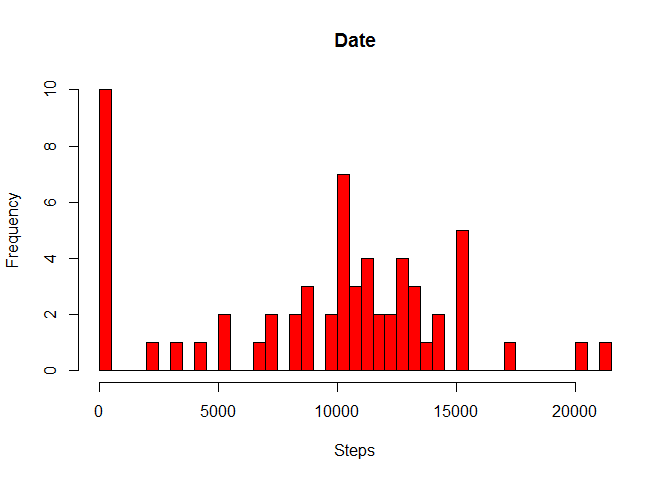
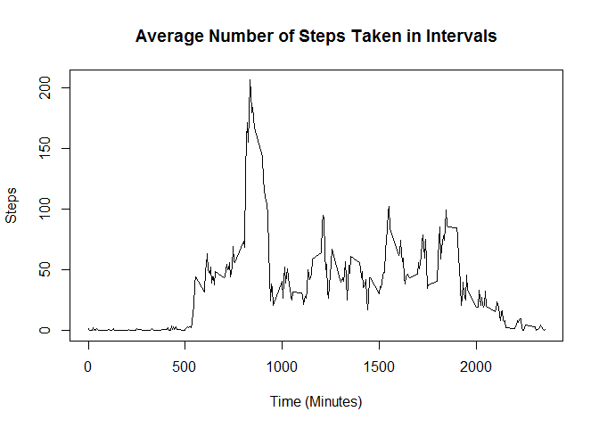
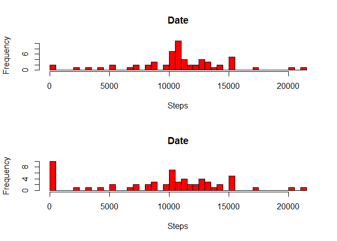
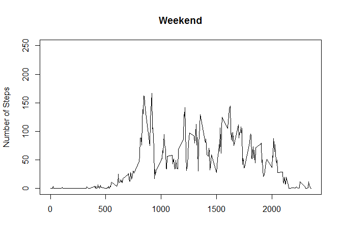
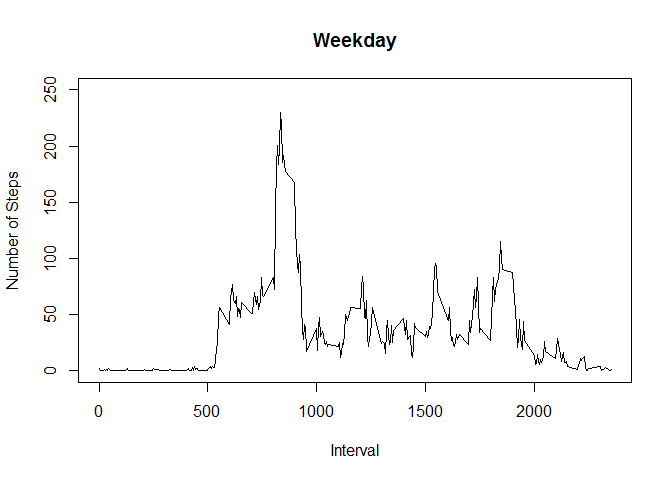

# Reproducible Research: Peer Assessment 1
Adam S  

## Loading and preprocessing the data

```r
#load libraries
library(ggplot2)
library(dplyr)
```

```
## 
## Attaching package: 'dplyr'
```

```
## The following objects are masked from 'package:stats':
## 
##     filter, lag
```

```
## The following objects are masked from 'package:base':
## 
##     intersect, setdiff, setequal, union
```

```r
library(doBy)
```

```
## Loading required package: survival
```

```r
#read the file
activity = read.csv("activity.csv", na.strings="NA", sep=",", stringsAsFactors=FALSE)

#summarizing data by day
activity_day <- group_by(activity, date)
activity_day_sum <- summarize(activity_day, day_sum = sum(steps, na.rm = TRUE)) 
```

##Histogram of the total number of steps taken each day



## What are mean and median total number of steps taken per day?


```r
summaryBy(steps ~ date, data = activity, FUN = list(mean, median))
```

```
##          date steps.mean steps.median
## 1  2012-10-01         NA           NA
## 2  2012-10-02  0.4375000            0
## 3  2012-10-03 39.4166667            0
## 4  2012-10-04 42.0694444            0
## 5  2012-10-05 46.1597222            0
## 6  2012-10-06 53.5416667            0
## 7  2012-10-07 38.2465278            0
## 8  2012-10-08         NA           NA
## 9  2012-10-09 44.4826389            0
## 10 2012-10-10 34.3750000            0
## 11 2012-10-11 35.7777778            0
## 12 2012-10-12 60.3541667            0
## 13 2012-10-13 43.1458333            0
## 14 2012-10-14 52.4236111            0
## 15 2012-10-15 35.2048611            0
## 16 2012-10-16 52.3750000            0
## 17 2012-10-17 46.7083333            0
## 18 2012-10-18 34.9166667            0
## 19 2012-10-19 41.0729167            0
## 20 2012-10-20 36.0937500            0
## 21 2012-10-21 30.6284722            0
## 22 2012-10-22 46.7361111            0
## 23 2012-10-23 30.9652778            0
## 24 2012-10-24 29.0104167            0
## 25 2012-10-25  8.6527778            0
## 26 2012-10-26 23.5347222            0
## 27 2012-10-27 35.1354167            0
## 28 2012-10-28 39.7847222            0
## 29 2012-10-29 17.4236111            0
## 30 2012-10-30 34.0937500            0
## 31 2012-10-31 53.5208333            0
## 32 2012-11-01         NA           NA
## 33 2012-11-02 36.8055556            0
## 34 2012-11-03 36.7048611            0
## 35 2012-11-04         NA           NA
## 36 2012-11-05 36.2465278            0
## 37 2012-11-06 28.9375000            0
## 38 2012-11-07 44.7326389            0
## 39 2012-11-08 11.1770833            0
## 40 2012-11-09         NA           NA
## 41 2012-11-10         NA           NA
## 42 2012-11-11 43.7777778            0
## 43 2012-11-12 37.3784722            0
## 44 2012-11-13 25.4722222            0
## 45 2012-11-14         NA           NA
## 46 2012-11-15  0.1423611            0
## 47 2012-11-16 18.8923611            0
## 48 2012-11-17 49.7881944            0
## 49 2012-11-18 52.4652778            0
## 50 2012-11-19 30.6979167            0
## 51 2012-11-20 15.5277778            0
## 52 2012-11-21 44.3993056            0
## 53 2012-11-22 70.9270833            0
## 54 2012-11-23 73.5902778            0
## 55 2012-11-24 50.2708333            0
## 56 2012-11-25 41.0902778            0
## 57 2012-11-26 38.7569444            0
## 58 2012-11-27 47.3819444            0
## 59 2012-11-28 35.3576389            0
## 60 2012-11-29 24.4687500            0
## 61 2012-11-30         NA           NA
```

#plot of the 5-minute interval (x-axis) and the average number of steps taken, averaged across all days (y-axis)



##The 5-minute interval that, on average, contains the maximum number of steps

```r
activity_interval_mean[which.max(activity_interval_mean$mean),1]
```

```
## Source: local data frame [1 x 1]
## 
##   interval
## 1      835
```


#The total number of missing values in the dataset (i.e. the total number of rows with NAs)

```r
count(activity[!complete.cases(activity),])
```

```
## Source: local data frame [1 x 1]
## 
##      n
## 1 2304
```

##Code to describe and show a strategy for imputing missing data

```r
#adding daily mean steps as variable to main table
activity_with_mean_interval <- merge(activity, activity_interval_mean, by.x="interval", by.y="interval", all=TRUE, na.rm=TRUE)

#replacing NAs with mean steps for the day
activity_with_mean_interval$steps[is.na(activity_with_mean_interval$steps)] <- 987654321
activity_with_mean_interval$steps <- ifelse(activity_with_mean_interval$steps == 987654321, activity_with_mean_interval$mean, activity_with_mean_interval$steps) 
```


##Histogram of the total number of steps taken each day after missing values are imputed

```r
#summarizing the data by date
activity_mean_interval_day <- group_by(activity_with_mean_interval, date)
activity_mean_interval_day_sum <- summarize(activity_mean_interval_day, day_sum = sum(steps, na.rm = TRUE))
```


##Panel plot comparing the average number of steps taken per 5-minute interval across weekdays and weekends


```r
#converting date character field to a date field
activity_with_mean_interval$date = strptime(activity_with_mean_interval$date, "%Y-%m-%d")

#adding new 'day' variable
activity_with_mean_interval$day <- weekdays(activity_with_mean_interval$date, abbreviate = TRUE)

#creating a new variable to categorize days into weekday and weekend days 
attach(activity_with_mean_interval)
activity_with_mean_interval$category[day == "Mon"] <- "Weekday"
activity_with_mean_interval$category[day == "Tue"] <- "Weekday"
activity_with_mean_interval$category[day == "Wed"] <- "Weekday"
activity_with_mean_interval$category[day == "Thu"] <- "Weekday"
activity_with_mean_interval$category[day == "Fri"] <- "Weekday"
activity_with_mean_interval$category[day == "Sat"] <- "Weekend"
activity_with_mean_interval$category[day == "Sun"] <- "Weekend"
detach(activity_with_mean_interval)

#subsetting the data between weekend and weekdays
activity_weekend <- subset(activity_with_mean_interval, category == "Weekend", select=c(interval, steps, mean))
activity_weekday <- subset(activity_with_mean_interval, category == "Weekday", select=c(interval, steps, mean))

#calculate mean and median values per day
#group steps by interval and calculate the mean of steps by interval
activity_weekend_interval <- group_by(activity_weekend, interval)
activity_weekend_interval_mean <- summarize(activity_weekend_interval, mean = mean(steps, na.rm = TRUE))

activity_weekday_interval <- group_by(activity_weekday, interval)
activity_weekday_interval_mean <- summarize(activity_weekday_interval, mean = mean(steps, na.rm = TRUE))
```

